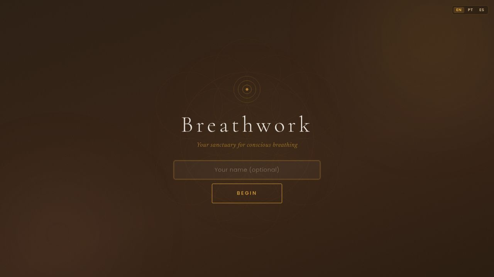

# 🌬️ The Breathing App

A sophisticated breathwork timer featuring 24 techniques, an animated breath ring, synthesized audio tones, session tracking, and a goal-based technique picker — all running entirely in your browser with no account required.



---

## Features

- **24 breathing techniques** — Wim Hof, Box Breathing, Bhramari, Kapalabhati, 4-7-8, Tummo, Nadi Shodhana, and many more
- **15 goal categories** — Energy, Focus, Sleep, Calm, Anger, Trauma, Grief, Bleak, and more
- **Animated breath ring** — SVG ring that fills during each phase, colour-coded by phase type
- **Web Audio API** — synthesised tones for every phase, bee hum for Bhramari
- **Session tracking** — day streak, total sessions, 90-day activity heatmap
- **Session history** — with mood log and CSV export
- **Favourites** — heart any technique for instant access
- **Goal-based picker** — choose your intention, get the right technique + classical music suggestion
- **Multilingual** — English, Portuguese, Spanish
- **Gratitude moments** — optional pre-session reflection
- **Quick-reference table** — maps everyday situations to ideal techniques
- **Pure frontend** — no login, no server, all data stays in your browser

---

## Running Locally

### Prerequisites

- [Node.js 24+](https://nodejs.org/)
- [pnpm 9+](https://pnpm.io/installation)

### Install dependencies

```bash
pnpm install
```

### Start the app

```bash
pnpm --filter @workspace/breathwork run dev
```

Then open [http://localhost:18595](http://localhost:18595) in your browser.

### Other commands

| Command | Description |
|---|---|
| `pnpm --filter @workspace/api-server run dev` | Start the API server (port 5000) |
| `pnpm run typecheck` | Type-check all packages |
| `pnpm run build` | Full build across all packages |

---

## Tech Stack

| Layer | Technology |
|---|---|
| Frontend | React 18 + Vite 7 |
| Language | TypeScript 5.9 |
| Styling | Plain CSS (no Tailwind) |
| Audio | Web Audio API (no external audio dependencies) |
| State | `localStorage` (no backend required) |
| Fonts | Cormorant Garamond + Newsreader |
| Package manager | pnpm workspaces monorepo |

---

## Project Structure

```
artifacts/
  breathwork/        # Main React app (pure frontend)
    src/
      components/    # UI components (BreathRing, GoalScreen, SessionScreen, …)
      data/          # Technique and goal definitions (24 techniques + 12-15 categories)
      hooks/         # Audio engine, session storage, favourites
      i18n/          # EN / PT / ES translations
  api-server/        # Minimal Express server (health endpoint)
```

---

## Live App

Deployed at [Replit](https://replit.com).

## License

MIT
